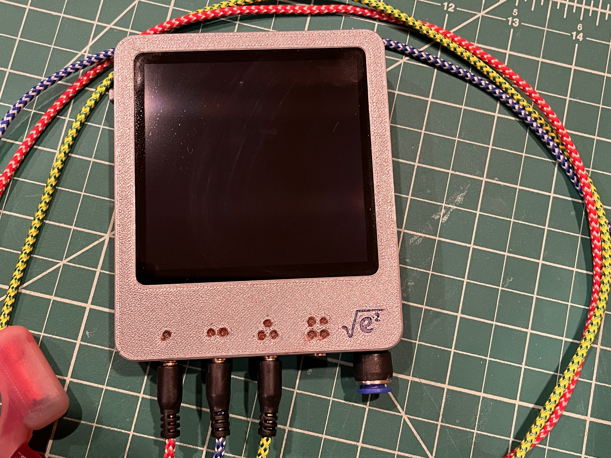
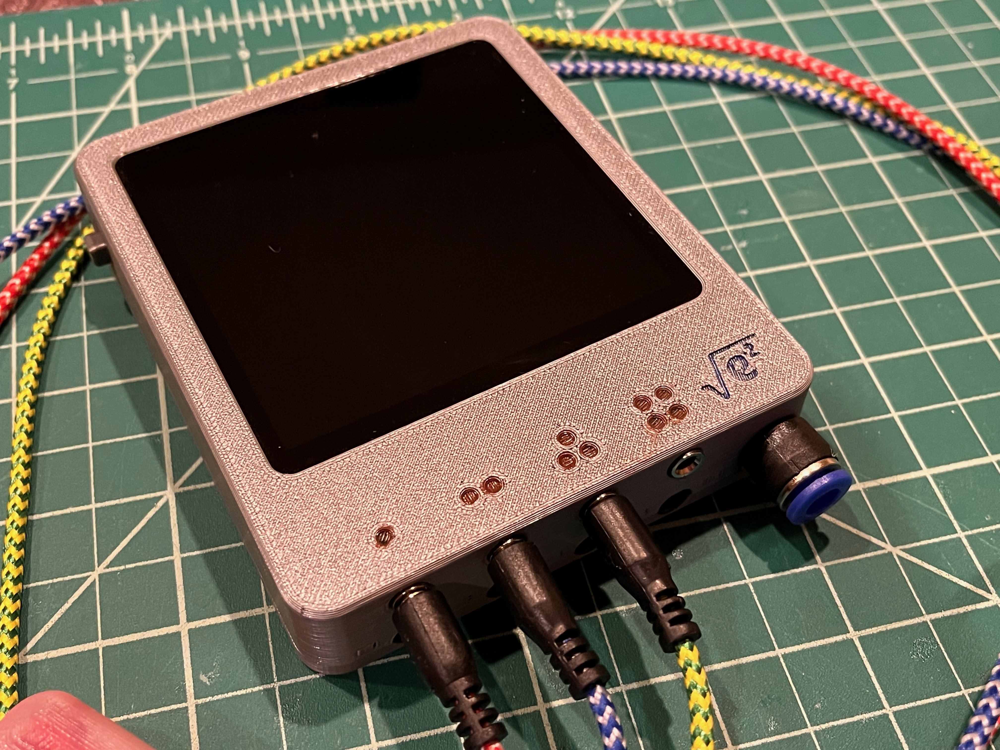
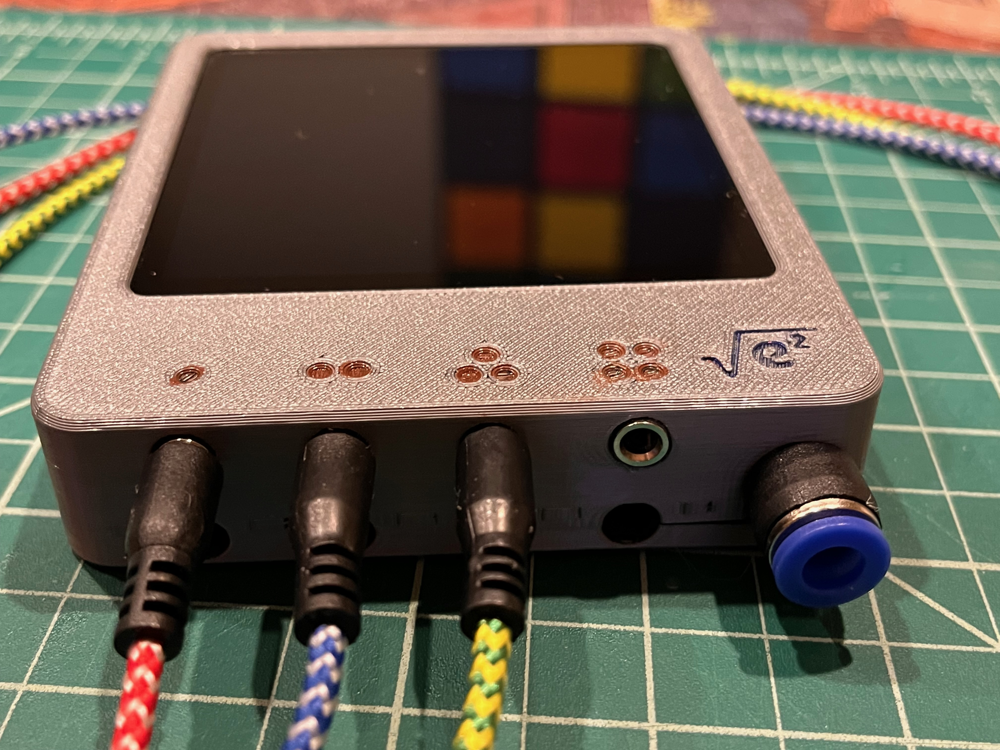
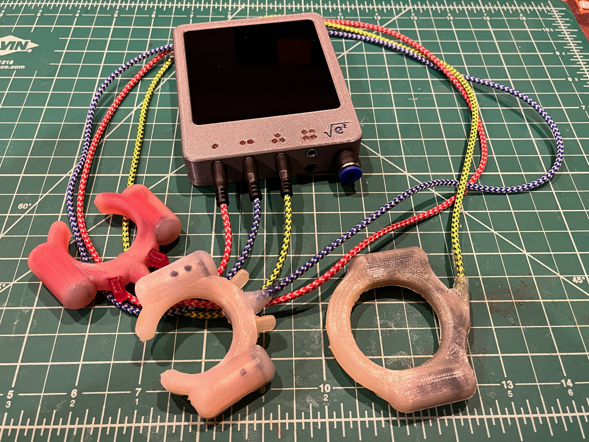
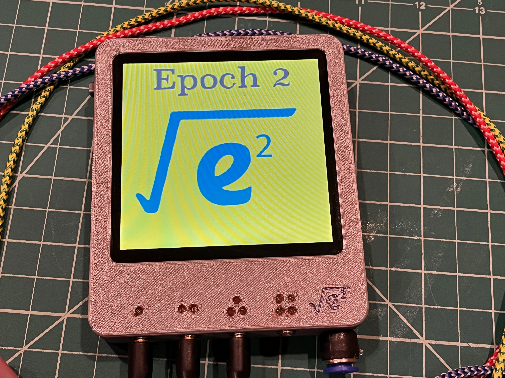
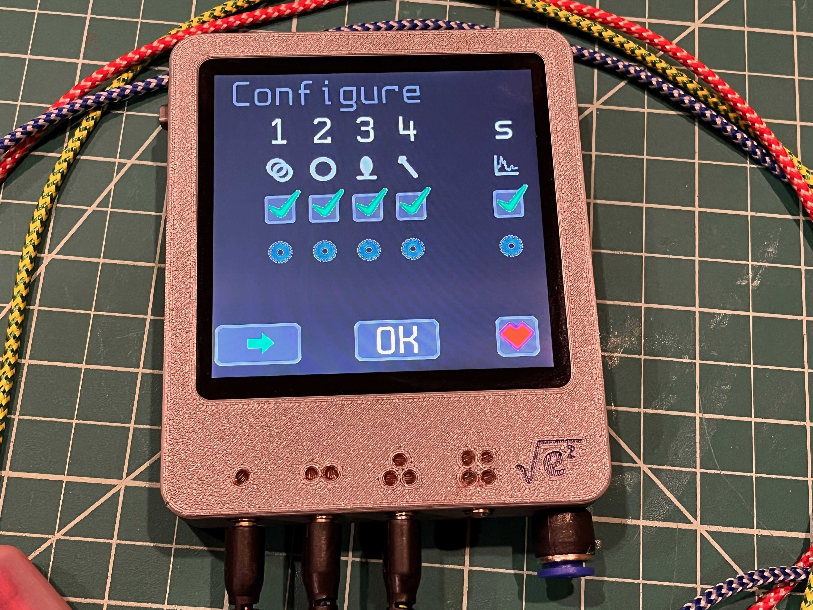
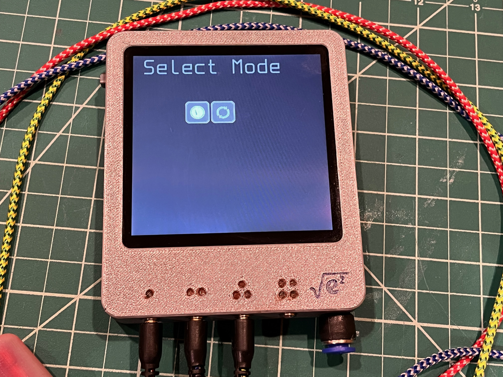
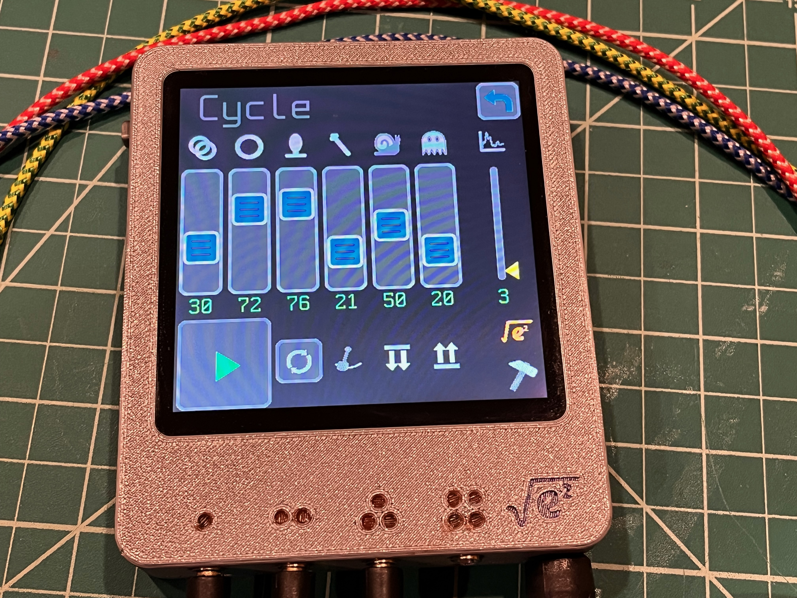
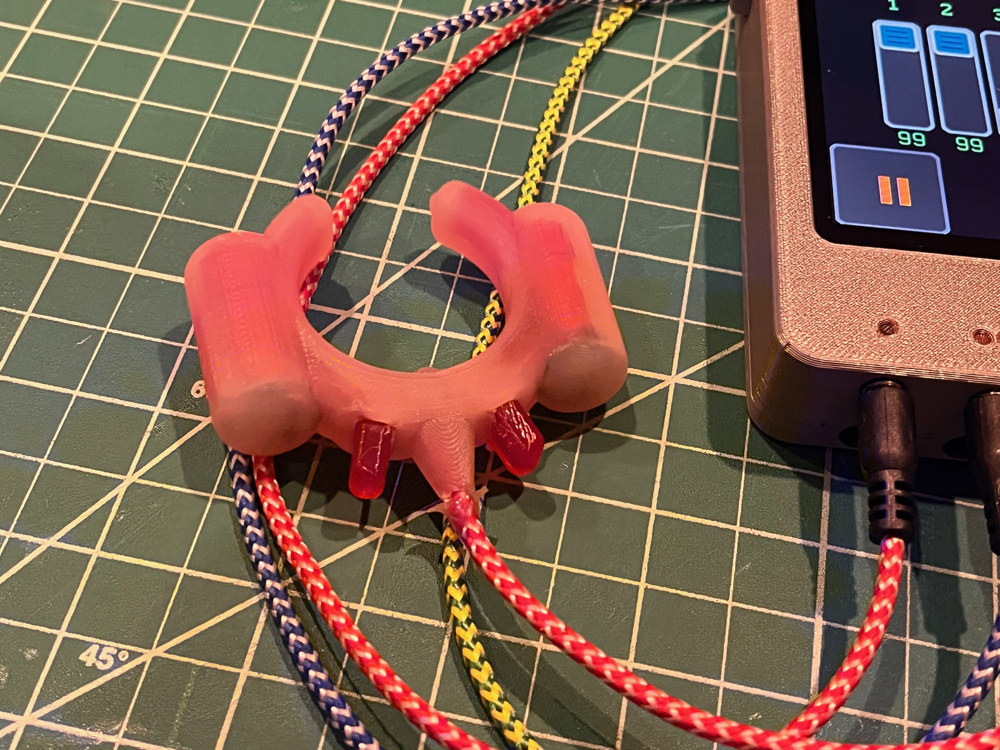
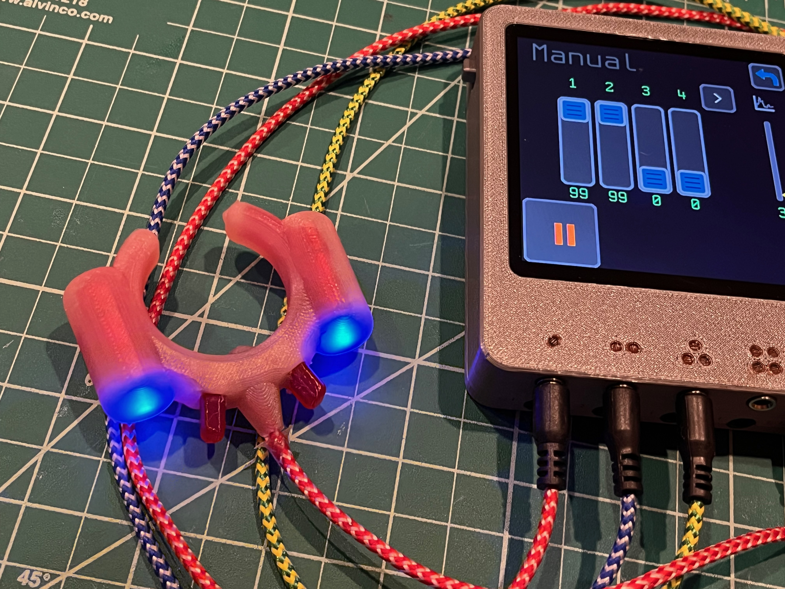

# epoch-2
Epoch Vibrator Controller *(Haptic Field Emitter)* 2 - Now with 100% more edge...

## Description
A follow on to [Epoch 1](https://github.com/CircuitMonkey/epoch).  Designed in 2025. Replaced by [Epoch 3](https://github.com/CircuitMonkey/epoch-3) in 2026. Redesigned with [AdaFruit Qualia ESP32](https://www.adafruit.com/product/5800) and a [Amazon 4-inch IPS (GT911 touch)](https://www.amazon.com/dp/B0D9H3HWR3).  Motors driven with [pca9685 PWM controller](https://learn.adafruit.com/adafruit-16-channel-pwm-servo-hat-for-raspberry-pi)/[Amazon PCA9685 Board](https://www.amazon.com/dp/B0D73811V8) and FET outputs in order to drive bigger motors.  Epoch 1 was limited to 120mA maximum motor drive (because of PWM controller choice) and some larger "rumble" motors need 180mA or higher.

## Features
 - [Adafruit Qualia ESP32-S3 RGB666](https://www.adafruit.com/product/5800)
 - [Amazon 4-inch IPS (GT911 touch)](https://www.amazon.com/dp/B0D9H3HWR3)
 - [pca9685 PWM controller](https://learn.adafruit.com/adafruit-16-channel-pwm-servo-hat-for-raspberry-pi)
 - [LiPo Battery - 62mm x 50mm, 2500mAH, Adafruit](https://www.adafruit.com/product/328)
 - TRS 3.5mm type cables (two motors per connector)
 - FET outputs in order to drive bigger motors.
 - Used [Electric Mini Micro Vibration Motor DC 1.5V/3V/6V 1000RPM M20 with Brass Eccentric Rotating Wheel ](https://www.amazon.com/dp/B07X7MKKQH) in attachments.
 - Programmed in CircuitPython.

## Dev Notes
 - Hardware was intended to output all 16 channels as two rows of connectors, but only built one row.
 - IPS type display used most of the ESP32 pins.
 - Circuit Python with the IPS display was excrucatingly slow.
 - Touch response time was very slow with Circuit Python and made on-screen sliders frustrating to use.
 - TRS Audio type connectors were a big improvement over Molex MinifitJr type connectors.
 - This platform performed well for almost a year, before Epoch-3 developed.
 - Experimental air pressure input showed promise but was fussy in setup/use and not worth using long term.
 - PCA9685 PWM driver was much easier to code with over older Epoch-1 PWM driver.
 - FET outputs allowed use of slightly bigger motors with more rumble yet allowed for a lower motor speeds for subtle haptic sensations.
 - Custom molds were 3D printed for attachments where silicone was poured over a TPU flex frame that held the motors.
 - Attachments had LEDs built in to indicate intensity of each motor.
 - This design and motor patterns have changed my life, able to realize two or three hour long usage sessions.
 - I look forward to improving on this design in Epoch 3.

